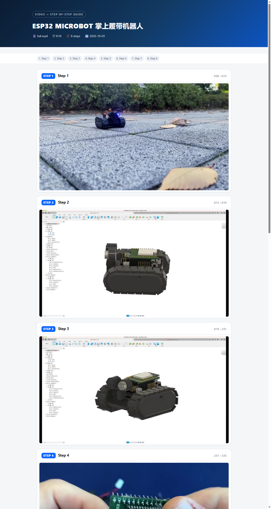

# video2guide

**English** | [简体中文](README.zh-CN.md)

**Turn tutorial videos into illustrated step-by-step guides (single-file HTML + PDF).**
**把教程视频一键转成图文分步攻略。**

> 🤖 This project was built end-to-end by **ZCode**, an AI coding agent powered by **GLM-5.3** (Zhipu AI / 智谱) — design, implementation, testing and this repository, in a single session.
> 本项目由智谱 **GLM-5.3** 驱动的 AI 编程助手 ZCode 一次性完成开发、测试与发布。

Drop in any local video — `video2guide` detects scene cuts, pulls a keyframe for every
step, and lays everything out as a clean, shareable guide. It does the mechanical part
of video note-taking; you add the words.



## Why

Rewatching a 10-minute tutorial to write down "step 3 happens at 1:30" is tedious.
Scene detection and screenshots are robot work. `video2guide` watches the video for
you: it finds where each step begins, screenshots it, and hands you a polished HTML
page (plus optional PDF) with timestamps — which you can then flesh out at your own
pace.

## Quick start

Requires [Node.js](https://nodejs.org) ≥ 18. No dependencies to install — ffmpeg is
located automatically (system `ffmpeg` → `FFMPEG_PATH` → bundled copy via
`@ffmpeg-installer`), and PDF export uses Edge or Chrome found on your machine.

```bash
# from a git clone
node bin/video2guide.mjs my-tutorial.mp4 --pdf

# or install globally
npm i -g video2guide
video2guide my-tutorial.mp4 --pdf
```

That's the one-shot flow: detect steps → extract keyframes → `guide.html` (+ `guide.pdf`).

## The two-phase workflow (recommended)

Auto-detected steps get you 90% there; the last 10% is your words.

```bash
# 1. detection only -> steps.json + frames/
video2guide detect lecture.mp4 -o my-guide

# 2. open my-guide/steps.json and fill in "title" / "note" per step
#    (subtitles from --srt land in "subs" automatically)

# 3. re-render as often as you like
video2guide build --steps my-guide/steps.json --pdf
```

`steps.json` schema:

```json
{
  "title": "My Guide",
  "video": "lecture.mp4",
  "duration": 558.0,
  "steps": [
    {
      "id": 1,
      "start": 0, "end": 13.0,
      "title": "Intro",              // your words (optional)
      "note": "What happens here",   // your words (optional)
      "image": "frames/step-01.jpg",
      "subs": ["attached subtitle lines"]
    }
  ]
}
```

⚠️ `detect` overwrites `steps.json` — edit between `detect` and `build`.

## Options

| Option | Default | Meaning |
| --- | --- | --- |
| `-o, --out <dir>` | `./video2guide-out` | output directory |
| `-t, --title <s>` | video filename | guide title |
| `--fps <n>` | `2` | sampling rate for cut detection |
| `--threshold <n>` | adaptive | manual MAD cut threshold (0–255) |
| `--min-gap <sec>` | `3` | minimum seconds between steps |
| `--max-steps <n>` | `60` | step cap |
| `--width <px>` | `1280` | keyframe max width |
| `--srt <file>` | — | attach SRT subtitles to their steps |
| `--url <u>` | — | source page URL; timestamps deep-link into it (`?t=sec`) |
| `--pdf` | off | also export PDF (needs Edge/Chrome) |
| `--no-embed` | embed | reference frame files instead of base64-inlining |
| `--qa` | off | tag output with `data-qa` (for screenshot self-tests) |
| `--ffmpeg <path>` | auto | ffmpeg binary location |
| `--browser <path>` | auto | browser binary for PDF |

## How it works

1. **Sample** — ffmpeg pipes a 64×36 grayscale stream of the whole video (`fps=2`)
   into Node; no image decoding in JS.
2. **Detect** — mean-absolute-difference between consecutive frames; the cut
   threshold adapts robustly (median + 4×MAD, so a few hard cuts don't skew it),
   with local-maximum picking, a min-gap constraint and an iterative ramp to honor
   `--max-steps`.
3. **Extract** — one full-res JPEG per step at its start timestamp.
4. **Render** — a single self-contained HTML file (images inlined, print CSS) and,
   with `--pdf`, a headless Edge/Chrome print-to-pdf pass.

Everything runs locally; nothing is uploaded anywhere.

## Tips & limits

- **Best results** on videos with distinct scenes: screen recordings, slide decks,
  assembly/demo videos with hard cuts.
- **Continuous handheld footage** (walking camera, little cutting) has a high motion
  baseline — expect chapter-level steps. Lower `--threshold` for finer splits, then
  curate `steps.json`; that's what the two-phase workflow is for.
- Subtitles make guides much better — if you have an SRT, use it.
- `guide.html` embeds images by default, so it's one portable file you can send
  anywhere. Use `--no-embed` if you prefer a small HTML plus a `frames/` folder.
- Video downloading is out of scope on purpose — feed it files you already have.

## Roadmap

- [ ] `--ai`: draft step titles/notes via a local LLM
- [ ] OCR of on-screen text into step notes
- [ ] Direct URL input (YouTube/bilibili) via yt-dlp if present

PRs welcome — the codebase is ~600 lines of dependency-free ESM.

## License

[MIT](LICENSE)
